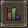
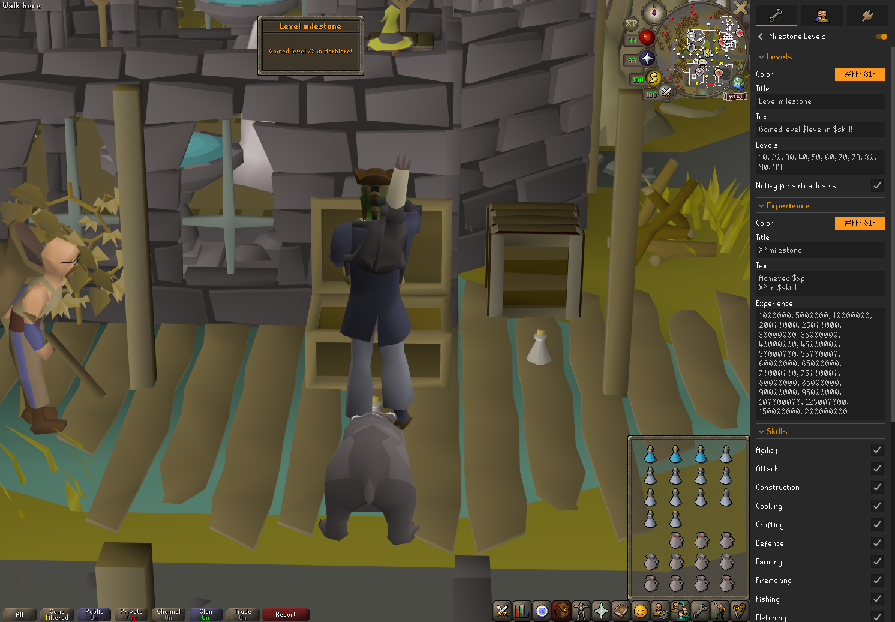

# Milestone Levels 

Gives you a way to get a fancy league-like notification whenever you level up!

## Features:

- Set your desired notification title and text (and color)
- Select specific levels for the notification to trigger, or leave empty to trigger for each level
- Select specific skills for notifications to trigger on.
- Notify for virtual levels: Every level after level 99 will notify you regardless if the skill is disabled or on the list.

