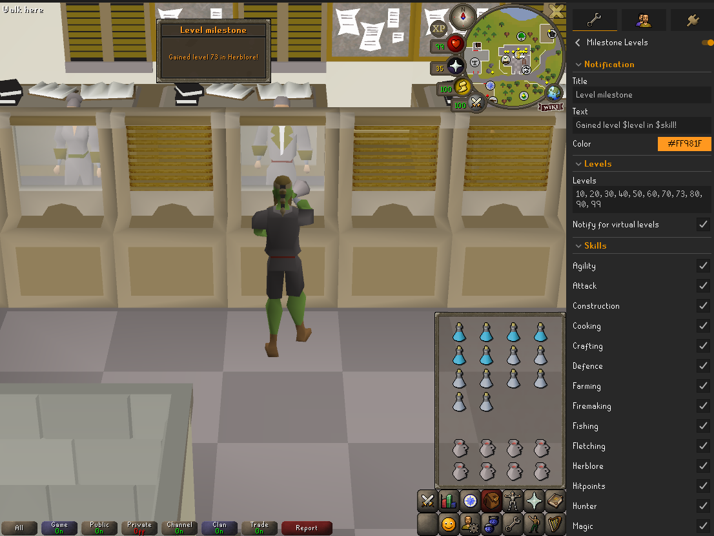

# Milestone Levels 

Gives you a way to get a fancy league-like notification whenever you hit a level or XP milestone!

## Features:

- Customize notification titles, text, and colors for both level and XP milestones.
- Define specific level or XP targets that trigger notifications.
- Choose which skills should trigger notifications.
- Optionally enable notifications for virtual levels (this applies to all skills regardless of your skill selections). This is enabled by default.
- Want to be notified for every level? Add the following list to the levels field: `2, 3, 4, 5, 6, 7, 8, 9, 10, 11, 12, 13, 14, 15, 16, 17, 18, 19, 20, 21, 22, 23, 24, 25, 26, 27, 28, 29, 30, 31, 32, 33, 34, 35, 36, 37, 38, 39, 40, 41, 42, 43, 44, 45, 46, 47, 48, 49, 50, 51, 52, 53, 54, 55, 56, 57, 58, 59, 60, 61, 62, 63, 64, 65, 66, 67, 68, 69, 70, 71, 72, 73, 74, 75, 76, 77, 78, 79, 80, 81, 82, 83, 84, 85, 86, 87, 88, 89, 90, 91, 92, 93, 94, 95, 96, 97, 98, 99`

## Notes
The notifications are disabled on league worlds and also when you are in LMS. This is to prevent you from getting spammed by notifications.

## Screenshot

